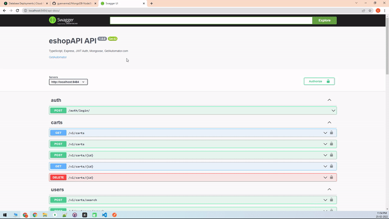

# MongoDB-NodeJS-REST-API-TypeScript-JWT
Create a mongoDB connected NodeJS REST API using TypeScript With JWT Authentication + Postman + Swagger

#Technology Used
- NodeJS
- TypeScript
- Mongodb Mongoose
- Mongodb Atlas
- Express
- hapi__joi for Validation
- dotenv - for env file management
- express-fileupload - for file upload
- chai, supertest - For Unit testing
- Postman , Swagger - API documentation
- helmet, cros for securting
- tslint, nodemon for development

# Folder & File Structure

### Entry Point
  - src/server/index.ts - Starting of project configuration, port, ssl
### Routes 
  - src/routes - Main routes defined here
  - src/routes/{collectionName} - Individual collection routes , linked to main route
### Configuration & Env
  - src/config/env/index.ts - If you want to add new env variable
  - src/config/middleware/middleware.ts - JWT validtion and other express route middleware can be found here
### Function & Schema of Mongodb Collection
  - src/components - Logical folder, all the logics, interface , model, validation defined in this folder
  - src/components/Auth - Function, Inteface realted to JWT authentication
  - src/components/{collectionName}/interface.ts - Interface for service of that collection is defined here
  - src/components/{collectionName}/model.ts - Define the actual collection schema
  - src/components/{colectionName}/service.ts - Actual call to mongodb is written here
  - src/components/{collectionName}/validation.ts - Validation function realted to that particular collection
  - src/components/{collectionName}/index.ts - Entry point to that particular collection, business logic can be added here. These functions will be called from route
### Unit Testing
  - src/test - Write your unit test here

# Support Reference & PR
- [Explore JWT Auth Token Function + Remove Password property from JWT](https://github.com/gyanverma2/MongoDB-NodeJS-REST-API-TypeScript-JWT/pull/1)
- [Access user data embedded in token object](https://github.com/gyanverma2/MongoDB-NodeJS-REST-API-TypeScript-JWT/pull/2)
- [Populate related collection](https://github.com/gyanverma2/MongoDB-NodeJS-REST-API-TypeScript-JWT/pull/3)
- More will be added based on support request

# Youtube Videos
- [Tool Demo Video](https://www.youtube.com/watch?v=4R8oJVbv7KU)

### [Dowload From CodeCanyon](https://codecanyon.net/item/100-automatic-mongodb-rest-api-generator-nodejs-typescript-rest-api-jwt-auth-swagger/35214206)

